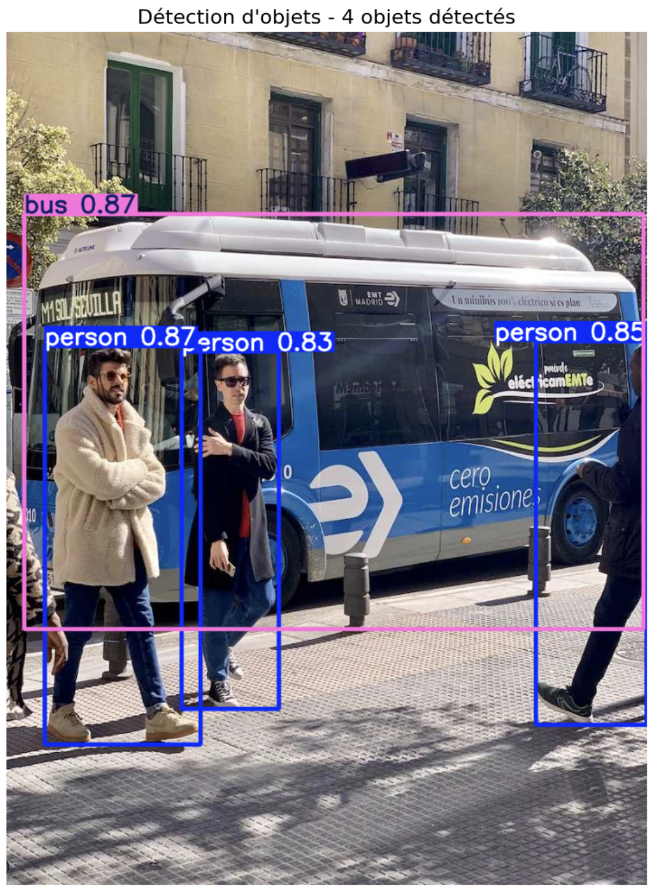
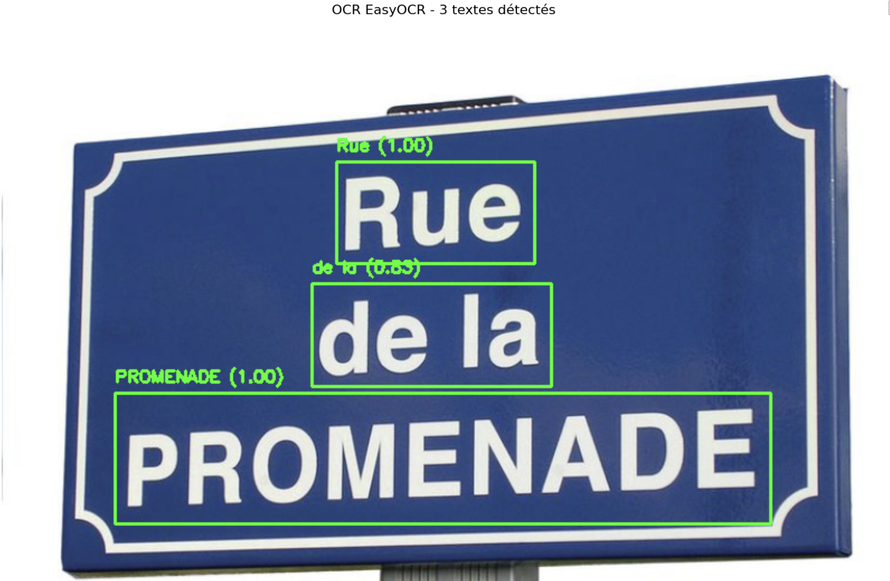
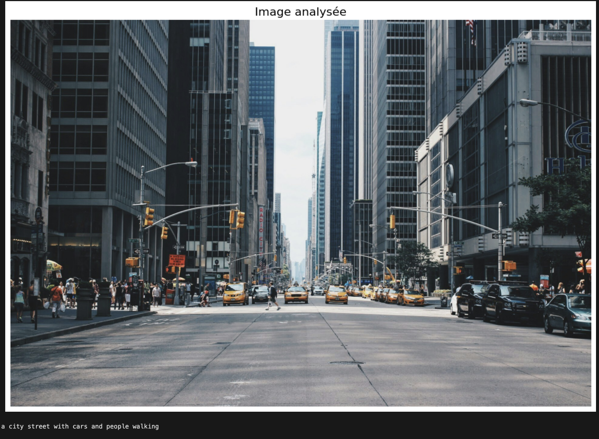

# Using Computer Vision to Assist the Visually Impaired
**A Multi-Modal Deep Learning Approach**

*Nawel Zait & Victor Micha*

---

# The Problem
**253 Million People Worldwide Face Daily Challenges**

Traditional aids (white canes) only detect immediate obstacles
- Cannot read street signs
- Cannot identify approaching vehicles
- No contextual understanding of scenes

**Our Goal:** Translate visual information into actionable audio guidance in real-time

---

# Our Solution - Four Integrated Modules

**Multi-Modal Deep Learning System**

1. **YOLOv8** - Real-time obstacle detection & distance estimation
2. **EasyOCR** - Text recognition (street signs, labels)
3. **BLIP** - Natural language scene descriptions
4. **ImageNet Classifiers** - Product identification

**Key Innovation:** Interactive Q&A capability for natural language queries + Real Time Alert System

---

# System Architecture

**Parallel Processing Pipeline**
- Input: Camera video/images
- Four modules process simultaneously
- Output: Prioritized audio alerts + Interactive Q&A

**Performance:**
- 12.7 FPS real-time processing
- 85% distance estimation accuracy
- 100% environment detection accuracy

---

# Module I - Object Detection (YOLO)

<!-- This creates a two-column layout -->

**Real-time Visual Perception**
- YOLOv8n model (lightweight, fast)

**Key Features:**
- Distance estimation: Very Close (<2m), Close (2-5m), Far (>5m)
- Spatial positioning: Left/Center/Right
- Critical obstacle alerts: People, vehicles, traffic signs

**Accuracy:** 94% position accuracy, 85% distance accuracy

---

# Modules II & III - Text & Scene Understanding

**Module II: OCR Text Recognition**
- Dual-engine: EasyOCR + Tesseract
- Reads street signs, license plates, etc
- Smart deduplication (85% sim threshold)
- French/English support

**Module III: Scene Description (BLIP)**
- Generates natural language descriptions
- Updates every 3 seconds
- Auto-detects in/outdoor environments
- 100% environment class. accuracy

---

# Intelligent Alert System

**Three-Level Priority System**
1. **Critical** - Very close obstacles (<2m) - Immediate alerts
2. **Warning** - Nearby objects (2-5m) - Rate-limited
3. **Informational** - Street signs, scene descriptions - Lower frequency

**Cognitive Load Management:**
- Maximum 2 alerts/second
- 3-second minimum between similar alerts
- Smart deduplication to reduce redundancy

---

# Interactive Q&A - Game Changer

**Natural Language Queries:**
- "Where am I?" → Identifies street names from OCR
- "What's around me?" → Lists detected objects
- "Is it safe?" → Evaluates obstacle distances
- "How many cars?" → Counts specific objects

**Context-Aware Responses:**
- Synthesizes information from all modules
- Adapts to indoor/outdoor environments
- 100% accuracy on spatial queries
- 83% accuracy on safety assessments

---

# Results & Comparison

**Our System vs. Prior Work (Ahmad et al.)**

**Advantages:**
✓ OCR integration (absent in prior work)
✓ Interactive Q&A system (major innovation)
✓ Intelligent 3-level TTS alerts
✓ No custom training required - all pre-trained models
✓ True real-time capability (12.7 FPS)

**Deployment Benefits:**
- Immediate real-world deployment
- Works across diverse environments
- Comprehensive text support

---

# Impact & Future Work

**Real-World Impact**
- Improved mobility and independence
- Real-time comprehensive environmental information
- Natural interactive dialogue capabilities

**Future Enhancements:**
- Dedicated depth model for precise distance (KITTI dataset)
- 30 FPS optimization for live video
- Multi-language support (Arabic, Spanish, Chinese)
- GPS integration for turn-by-turn navigation
- Edge deployment (mobile devices, Raspberry Pi)

**Thank you! Questions?**